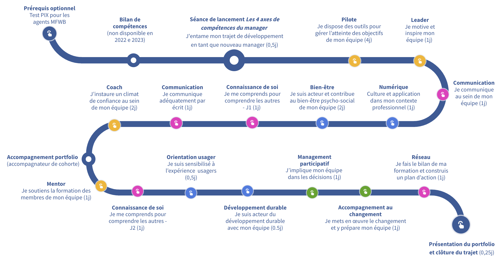

# C'est la rentrée pour moi aussi ! La formation FoCoMan pour managers redémarre en effet

Lorsque je suis devenu **attaché responsable** du service des accidents du travail au Ministère de la Fédération Wallonie-Bruxelles, ma cheffe m'a immédiatement inscrit au tout nouveau trajet de **formation FoCoMan**, une formation cohérente pour manager organisée par l'_École d'Administration Publique Wallonie-Bruxelles_ (EAP) [1].

Après avoir suivi les quatre premiers modules de la formation, sur une durée de sept jours, avant la pause estivale de juillet et aout, je me prépare aujourd'hui à **faire ma rentrée** dès demain, avec un enthousiasme certain ! J'ai, en effet, hâte :
- de découvrir les _contenus_ des modules suivants,
- de pouvoir retourner à _Namur_ pour y passer une journée déconnecté du travail,
- de revoir mes _co-apprenants_ provenant d'autres institutions publiques de la mienne,
- et, enfin, de découvrir ou redécouvrir les _formateurs et formatrices_ :-)

Dans cet article, je vais prendre le temps de **tirer un bilan** de ce que j'ai déjà retiré de la formation FoCoMan, des premiers modules suivis et des mises en pratique déjà réalisées au sein de mon service.

## Un parcours intégré et cohérent

La _formation FoCoMan_ [2] est une formation qui a pour but d'accompagner les **managers de la fonction publique**. Elle permet de couvrir quatre axes de compétences qui permettent de former des managers **réflexifs, humains, agiles et connectés** aux enjeux de leur administration. Elle a démarré en mode pilote à l'automne 2022 et j'ai la chance de faire partie des premières cohortes qui peuvent la suivre.

Deux variantes de la formation sont proposées. Celle que je suis s'intitule _« FoCoMan - Formation de base des managers de terrain »_. Elle se compose de **20 jours de formation** répartis sur une période de 8 à 12 mois, et se termine par une certification.

Les quatre premiers modules m'ont permis de découvrir une **série de concepts** que je trouve très intéressants et importants.

En vrac, j'ai découvert les _quatre casquettes du manager_ (pilote, leader, mentor et coach), les _cercles d'influence_, la différence entre _groupe et équipe_ et le _modèle de Tuckman_, la _roue de Deming_, le _diagramme d'Ishikawa_, la _matrice d'Eisenhower_ et celle de _RACI_, la _grille d'Ardoino_, le _triangle du sens_, la _fenêtre de Johari_, etc. Et à côté de tous ces outils, j'ai également découvert de nombreux principes. Oufti, tout ça dans 4 modules ! Et ce n'est qu'un début, j'ai vraiment hâte de la suite :-)

## Des trucs et astuces en lien direct avec mon expérience

Contrairement à d'autres formations que j'ai eues l'occasion de suivre, ou de livres lus, sur le management, qui étaient très académiques et théoriques, le trajet FoCoMan est vraiment très **pratique et concret**. Pour le moment, il m'a permis de m'équiper de **nombreux outils**, de **réfléchir** sur mes propres pratiques et m'a incité à **expérimenter** certaines choses avec mon service.

Une autre richesse, c'est son **application directe** sur des exemples rapportés par les apprenants. D'un côté, on peut partager nos expériences entre membres d'une même cohorte d'apprenants et, d'un autre, on peut venir avec ses propres difficultés ou défis et discuter avec les formateurs et ses co-apprenants pour dégager des pistes de solution.

Évidemment, comme toute formation aussi dense, et dans nos types de métier, une difficulté consiste à pouvoir **prendre le temps** d'assimiler les concepts et techniques découverts et les appliquer concrètement. En tout cas, j'essaie, comme je peux, de prendre ce temps et ce que je parviens déjà à faire en vaut vraiment la peine ! Je tâcherai de partager certaines de ces expériences sur mon blog !

## Une expérience humaine

Un dernier élément que je voulais partager est l'**expérience humaine** vécue grâce à cette formation. Tout d'abord, cela m'a permis de rencontrer des fonctionnaires et travailleurs d'autres institutions publiques. D'un côté, c'est rassurant de voir que l'on partage les mêmes difficultés et les mêmes envies de faire évoluer et bouger les choses pour une **administration plus humaine et efficace**. D'un autre côté, cela peut faire peur de constater qu'il y a peut-être des faiblesses et inefficiences qui sont inhérentes aux services publics, tels qu'organisés aujourd'hui. Mais restons positifs, cela veut dire qu'il y a des **challenges à relever** et ceux qui me connaissent savent que j'aime ça !

Enfin, cette formation est également l'occasion de **croiser différents formateurs**, avec une longue et riche expérience et de nombreuses histoires à raconter. Des liens se tissent, des échanges et partages se font virtuellement par LinkedIn et j'ai même croisé, en réel et par hasard, l'une de mes formatrices dans les rues de Namur, quel plaisir !

## Références

[1] [École d'Administration Publique Wallonie-Bruxelles](https://www.eap-wb.be) (EAP), institution publique qui dispense des formations pour les fonctionnaires et travailleurs de différents organismes publiques en Wallonie et Fédération Wallonie-Bruxelles.  
[2] [FoCoMan : pour un management efficace, prenons le temps de la formation](https://lebulletin.eap-wb.be/management/focoman-management-vertueux-formation), EAP, le 26 aout 2022.
